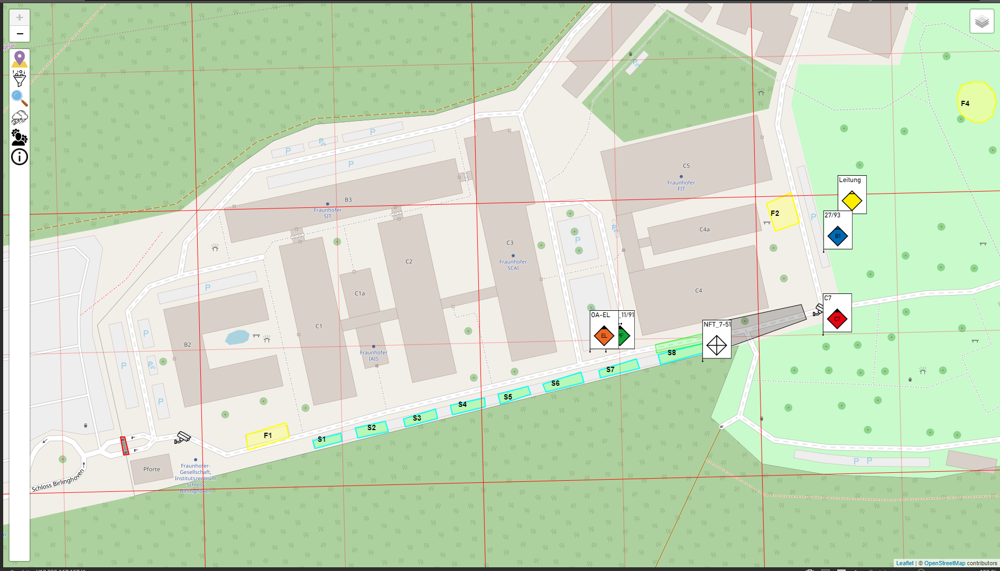

# Lora-Map
Lora-Map ist eine Karte die GPS-Positionen von Geräten anzeigt.


## Bedienung
In diesem abschnitt findet sich eine Bedienungsnleitung über alle Funktionen der Karte

### 1. Zoombuttons
  
Diese Knöpfe werden zum Steuern der Karte verwendet. Dabei kann mit ```+``` in die Karte hineingezoomt werden und mit ```-``` aus der Karte herraus.

### 2. Tracker
  
Über diesen Schalter lassen sich Informationen über alle, sowie über einzelne Tracker abrufen.

#### 2.1 Gesamtliste