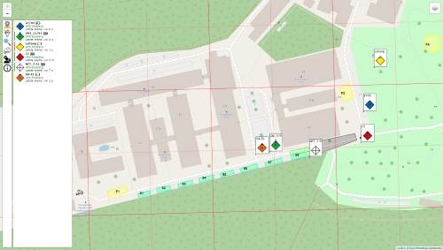

# Fraunhofer.Fit.IoT.LoraMap (Lora-Map)
<!-- Short description of the project. -->

Program that displays items with coordinates from Mqtt on a map. This readme is meant for describing the application. 

<!-- A teaser figure may be added here. It is best to keep the figure small (<500KB) and in the same repo -->

## Getting Started
<!-- Instruction to make the project up and running. -->

The project documentation is available on the [Wiki](https://github.com/MONICA-Project/lora-map/wiki).

## Deployment
<!-- Deployment/Installation instructions. If this is software library, change this section to "Usage" and give usage examples -->

This repository is only for containing the code from Lora-Map. If you want to develop, please goto the [Map-Project](https://github.com/MONICA-Project/map-project). This repository contains all references as github submodules, even this one.

## Development
<!-- Developer instructions. -->
* Versioning: Use [SemVer](http://semver.org/) and tag the repository with full version string. E.g. `v1.0.0`

### Prerequisite
This projects depends on different librarys.

#### Linking to
##### Internal
* BlubbFish.Utils ([Utils](http://git.blubbfish.net/vs_utils/Utils))
* BlubbFish.Utils.IoT ([Utils-IoT](http://git.blubbfish.net/vs_utils/Utils-IoT))
* BlubbFish.Utils.IoT.Bots ([Bot-Utils](http://git.blubbfish.net/vs_utils/Bot-Utils))
* BlubbFish.Utils.IoT.Connector.Data.Mqtt ([ConnectorDataMqtt](http://git.blubbfish.net/vs_utils/ConnectorDataMqtt))

##### External
* litjson
* M2Mqtt
* CordinateSharp

## Contributing
Contributions are welcome. 

Please fork, make your changes, and submit a pull request. For major changes, please open an issue first and discuss it with the other authors.

## Affiliation
  
This work is supported by the European Commission through the [MONICA H2020 PROJECT](https://www.monica-project.eu) under grant agreement No 732350.