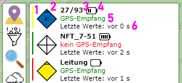
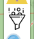

# Lora-Map
Lora-Map ist eine Karte die GPS-Positionen von Geräten anzeigt.

## Bedienung
In diesem abschnitt findet sich eine Bedienungsnleitung über alle Funktionen der Karte.

### 1. Zoombuttons
  
Diese Knöpfe werden zum Steuern der Karte verwendet. Dabei kann mit `+` in die Karte hineingezoomt werden 
und mit `-` aus der Karte herraus.

### 2. Tracker
  
Über diesen Schalter lassen sich Informationen über alle, sowie über einzelne Tracker abrufen.

#### 2.1 Gesamtliste
  
Hier wird eine Übersicht über alle aktiven Tracker angezeigt. Diese können angeklickt werden um Details zu 
diesen zu sehen (siehe Abschnitt 2.2).

##### 2.1.1 Batteriestatus
Der horizontale Balken in `Grün`, `Gelb` oder `Rot` zeigt den Akkuzustand schnell erkenntlich an. Grüne 
Tracker sind voll, Gelbe etwa halbvoll und Rote sollen geladen werden.

##### 2.1.2 Icon
Hier wird das Icon des Trackers dargestellt.

##### 2.1.3 Name
Hier erscheint der Eingetragene `Name` des Trackers. Dies kann ein Funkrufname oder auch ein anderes Kürzel 
sein. Die Anzahl der Zeichen ist begrenzt, da dieser Name auch auf der Karte über den Symbolen erscheint.

##### 2.1.4 Akkusymbol
Hier wird in einem 5 Stufensystem der Ladezustand des Trackers angezeigt. Jede Stufe entpricht etwa 3 
Stunden und 10 Minuten (Gesamtlaufzeit etwa 16 Stunden.)

##### 2.1.5 GPS-Status
Hier wird dargestellt ob der Tracker bei seinem letzten Empfang ein gültiges GPS-Signal gesendet hat, also 
selbst Empfang hatte. In Gebäuden oder unter Brücken kann es passieren das der Tracker keinen Empfang 
mehr hat. Ebenso ist der Empfang nach dem Einsachalten nicht sofort verfügbar.

##### 2.1.6 Letzer Signalempfang
In dieser Zeile wird die Zeitspanne seit dem letzten Signalempfang über Funk vom Tracker angezeigt. Somit 
ist ersichtlich wie Aktuell die genannte Posiotion auf der Karte ist.

#### 2.2 Tracker-Detail
  
Diese Ansicht zeigt Details zu einem Tracker an, sobald dieser über die Karte oder die Gesamtliste 
ausgewählt wurde. Sollte bei einem Tracker der Alarmknopf gedrückt werden, wird diese Ansicht ebenfalls 
geöffnet.

##### 2.2.1 Name
Siehe 2.1.3.

##### 2.2.2 Akkusymbol
Siehe 2.1.4. Zusätzlich wird die Spannung in Volt angezeigt.

##### 2.2.3 GPS-Status
Siehe 2.1.5.

##### 2.2.4 MGRS-Koordinaten
Koordinaten des Trackers im UTM-Referenzsystem. Hier wird der zuletzt empfangene Wert angezeigt.

##### 2.2.5 Höhe
Die Höhe der Position des Trackers in Meter über NN.

##### 2.2.6 HDOP
Die [ungenauigkeit](https://de.wikipedia.org/wiki/Dilution_of_Precision) des GPS-Signals. Achtung, dieser 
Wert ist keine Angabe in Metern. Gute Werte sind kleiner 1,2

##### 2.2.7 GPS-Koordinaten
Die MGRS-Koordinaten umgerechnet in Dezimalgraden.

##### 2.2.8 Letzter GPS Wert
Diese Angabe bezieht sich auf die letzten korrekt Empfangenen Koordinaten, somit kann festgestellt werden
ob ein Tracker GPS-Empfang hat. Ein Tracker kann unter umständen Empfangen werden, aber z.B. innerhalb 
eines Gebäudes sein und selbst keinen GPS-Empfang haben. Dort wird dann angezeigt wann er selbst zuletzt 
Empfang hatte.

##### 2.2.9 Update
Zeitpunkt und Zeitraum des zuletzt empfangen Funksignals.

##### 2.2.10 Empfangstärke
RSSI (Received signal strength indication) und SNR (Signal-to-noise ratio) geben die Qualität der
Funkverbindung zum Tracker an. Je größer die Werte desto besser.

##### 2.2.11 Alerts
Hier werden die letzten 10 Zeitpunkte der Alarmmeldungen angezeigt.

### 3. Filter
  
Über diesen Schalter lassen sich die Filtereinstellungen aufrufen.

### 3.1 Filter-Auswahl
  
In der Liste können die Gruppen ausgewählt werden, welche auf der Karte dargestellt werden sollen. Es
können mehrere Gruppen gleichzeit oder auch garkeine ausgewält werden (dann werden alle dargestellt).

### 3.2 Filter-Details