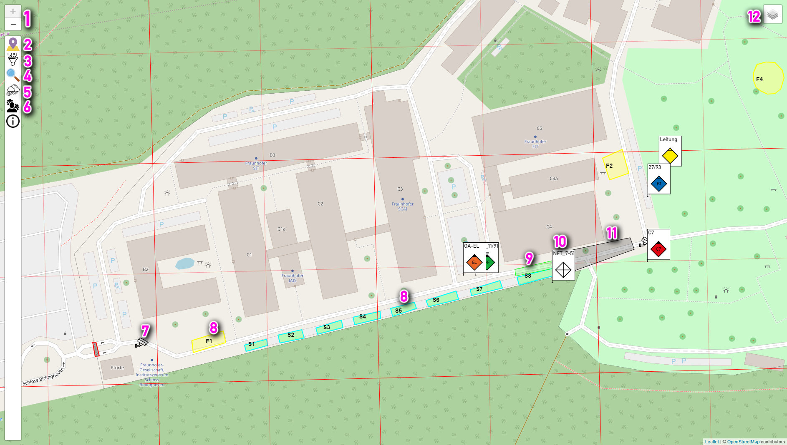
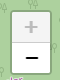

# Lora-Map
Lora-Map ist eine Karte die GPS-Positionen von Geräten anzeigt.

## Bedienung
In diesem abschnitt findet sich eine Bedienungsnleitung über alle Funktionen der Karte.

### 1. Zoombuttons
  
Diese Knöpfe werden zum Steuern der Karte verwendet. Dabei kann mit `+` in die Karte hineingezoomt werden und mit `-` aus der Karte herraus.

### 2. Tracker
  
Über diesen Schalter lassen sich Informationen über alle, sowie über einzelne Tracker abrufen.

#### 2.1 Gesamtliste
  
Hier wird eine Übersicht über alle aktiven Tracker angezeigt. Diese können angeklickt werden um Details zu diesen zu sehen [(siehe Abschnitt 2.2)][id_2_2].

##### 2.1.1 Batteriestatus
Der horizontale Balken in `Grün`, `Gelb` oder `Rot` zeigt den Akkuzustand schnell erkenntlich an. Grüne Tracker sind voll, Gelbe etwa halbvoll und Rote sollen geladen werden.

##### 2.1.2 Icon
Hier wird das Icon des Trackers dargestellt.

##### 2.1.3 Name
Hier erscheint der Eingetragene `Name` des Trackers. Dies kann ein Funkrufname oder auch ein anderes Kürzel sein. Die Anzahl der Zeichen ist begrenzt, da dieser Name auch auf der Karte über den Symbolen erscheint.

##### 2.1.4 Akkusymbol
Hier wird in einem 5 Stufensystem der Ladezustand des Trackers angezeigt. Jede Stufe entpricht etwa 3 Stunden und 10 Minuten (Gesamtlaufzeit etwa 16 Stunden.)

##### 2.1.5 GPS-Status
Hier wird dargestellt ob der Tracker bei seinem letzten Empfang ein gültiges GPS-Signal gesendet hat, also selbst Empfang hatte. In Gebäuden oder unter Brücken kann es passieren das der Tracker keinen Empfang mehr hat. 
Ebenso ist der Empfang nach dem Einsachalten nicht sofort verfügbar.

##### 2.1.6 Letzer Signalempfang
In dieser Zeile wird die Zeitspanne seit dem letzten Signalempfang über Funk vom Tracker angezeigt. Somit ist ersichtlich wie Aktuell die genannte Posiotion auf der Karte ist.

#### 2.2 Tracker-Detail